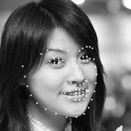
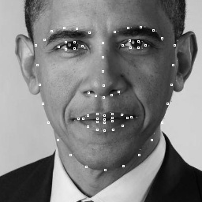
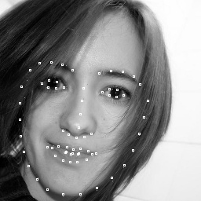

# 68dots_facealignment-master
68个点的人脸特征点检测 train and test
#### 主要 demo 简介：
 +  to_train.py: 训练
 -  test.py: 测试
 +  hg_net.py: < Stacked Hourglass Networks for Human Pose Estimation > 论文提出的 HourseglassNet
 -  fy_net.py: 实习公司前辈搭建的网络，原版本是 caffe，被我翻译了一版 pytorch
 +  deal300.py: 数据预处理，由于实际场景需要，把图片转换为黑白
 -  data_loader.py、test_data_loader.py: 数据载入, data_loader.py 与 test_data_loader.py 唯一区别：test_data_loader.py 比data_loader.py 多 return 了 img_name

#### 数据：
 + 这里只上传了 1k 训练图片和 316 张测试图片
 - 更多数据可前往300-w公开数据集下载：https://ibug.doc.ic.ac.uk/resources/300-W/

#### model：
 + ./good_model 里有在20W+数据集上已训练好的 model
 - 附上四张效果图片：
 +    
 - 如果想要效果更好的 model 可前往这里：https://github.com/1adrianb/face-alignment
 + 可惜这里只给出了测试方法，并未给出训练方法
 
#### 其他：
 + fy_net 和 hg_net 的输入并不相同：fy_net 的输入是 128×128, hg_net 则是 256×256
 

